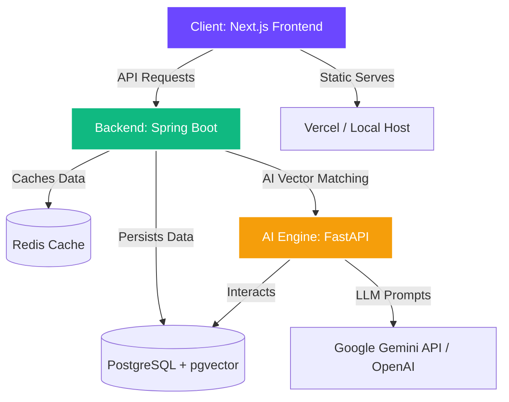

# GrantAI 🚀

```
   ______                 __  ___   ____
  / ____/____  ____ _____  / /_/   | /  _/
 / / __ / ___// __ `/ __ \/ __/ /| | / /  
/ /_/ // /   / /_/ // / / / /_/ ___ |/ /   
\____//_/    \__,_//_/ /_/\__/_/  |_/___/  
                                           
```

### AI-Powered Grant Discovery & Writing Platform

> Find, match, and win grants faster. GrantAI analyzes thousands of funding opportunities, ranks suitability score vectors, drafts compelling custom cover letters, and simulates review panels dynamically.

---

## Monorepo Layout

```
grantai/
├── frontend/          ← Next.js 14 (App Router) · React · Zustand · Tailwind
├── backend/           ← Spring Boot 3 · Java 21 · PostgreSQL · JPA · Security
├── ai-engine/         ← FastAPI · Python 3.12 · LangChain · Gemini API · pgvector
├── docker-compose.yml ← Full multi-container development/production stack
├── .gitignore
├── LICENSE
└── README.md
```

---

## System Architecture



---

## Tech Stack & Core Infrastructure

| Layer | Technologies | Description |
|---|---|---|
| **Frontend** | Next.js 14, Zustand, Tailwind CSS, Framer Motion, react-window | Premium dark-mode UI with smooth layouts, light theme option, and responsive layouts. |
| **Backend** | Spring Boot 3, Java 21, Spring Security (JWT), Spring Data JPA | Relational business logic, token-based session auth, and scheduling. |
| **AI Engine** | FastAPI, Python 3.12, LangChain, pgvector | Vector embedding, semantic search index, and response streams. |
| **Database** | PostgreSQL 16 + pgvector | Relational schemas alongside vectorized matching capability. |
| **Cache** | Redis 7 | High performance key-value cache and session management. |
| **Infra** | Docker & Docker Compose | Containerized dev/prod environments with multi-stage configurations. |

---

## Guided Demo Mode (Instant Evaluation)

For hackathon judges and evaluations, GrantAI includes a **zero-dependency Guided Demo Mode**. This mode runs entirely client-side, allowing you to bypass database configurations, environment credentials, and server cold starts.

### Accessing Demo Mode:
1. Navigate to the landing page at `http://localhost:3000` (or the deployed URL).
2. Click the **"Try Demo Mode"** button in the hero CTA or the judges' top banner.
3. You will land on the `/demo` portal. Click **"Initialize Demo & Open Dashboard"**.
4. The system will seed a simulated PhD Bio-computation researcher profile (Dr. Alex Mercer at Stanford), pre-populate active tracker applications (NIH Director's Pioneer Award, NSF Fellowship), and log you in.
5. In Demo Mode, you can:
   - Drag-and-drop Kanban cards on the Tracker board.
   - Trigger simulated Server-Sent Events (SSE) cover letter streaming.
   - Run practice interview simulations with real-time AI score metrics.

---

## Getting Started

### Prerequisites

- [Docker Desktop](https://www.docker.com/products/docker-desktop/) ≥ 4.x
- [Node.js](https://nodejs.org/) ≥ 20 (for native frontend development)
- [Java 21](https://adoptium.net/) (for native backend development)
- [Python 3.12](https://www.python.org/) (for native AI engine development)

### 1. Clone & Configure

```bash
git clone https://github.com/Suthankan1/grantai.git
cd grantai
cp .env.example .env      # Fill in your key details if not running Demo Mode
```

### 2. Launch the Stack (Docker Compose)

Run the entire multi-container environment with a single command:

```bash
docker compose up --build
```

#### Service Endpoints:
- **Frontend Panel**: `http://localhost:3000`
- **Backend API**: `http://localhost:8080`
- **AI Engine Docs**: `http://localhost:8000/docs`
- **API Swagger Docs**: `http://localhost:8080/swagger-ui.html`

### 3. Native Service Development

If you prefer running services natively without containers:

#### Frontend:
```bash
cd frontend
npm install
npm run dev # Launches http://localhost:3000
```

#### Backend:
```bash
cd backend
mvn clean install
mvn spring-boot:run # Launches http://localhost:8080
```

#### AI Engine:
```bash
cd ai-engine
pip install uv
uv venv && source .venv/bin/activate
uv pip install -r requirements.txt
uvicorn app.main:app --reload # Launches http://localhost:8000
```

---

## Environment Variables

Configure these in the `.env` file at the root of the project:

```env
# Database Credentials
POSTGRES_PASSWORD=your_secure_password

# Authentication (JWT)
JWT_SECRET=your_jwt_secret_min_32_chars_long_string

# AI Credentials
GEMINI_API_KEY=your_gemini_api_key_here
AI_ENGINE_API_KEY=grantai_dev_ai_key
```

---

## Contributing

1. Fork the repository.
2. Create a feature branch: `git checkout -b feat/your-feature`.
3. Commit using conventional commits: `feat: add grant matching algorithm`.
4. Open a pull request.

---

## License

[MIT](./LICENSE) © 2026 GrantAI
